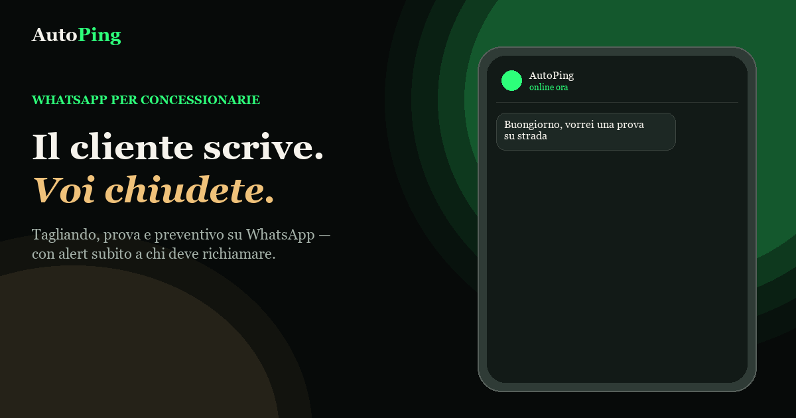

# AutoPing

**Il cliente scrive. Voi chiudete.**

Assistente WhatsApp per concessionarie: gestisce **tagliando**, **prova su strada** e **preventivo**, e avvisa subito chi deve richiamare.

  

  <a href="https://cyberneticwar.github.io/AutoPing/" target="_blank" rel="noopener noreferrer"><strong>Apri la presentazione →</strong></a>

---

## Perché AutoPing

- **Risposta subito** — il cliente sa che la richiesta è presa in carico  
- **Dati già pronti** — targa, fascia, linea: meno andirivieni in chat  
- **La persona giusta** — officina o commerciale ricevono solo ciò che compete loro  

## Come funziona

1. **Il cliente scrive** sul WhatsApp della concessionaria  
2. **AutoPing guida** il percorso e raccoglie i dati  
3. **Il team riceve un alert** e richiama con tutto già chiaro  

## Documentazione

Per il dettaglio tecnico: [vault/](vault/) — conversazione, routing staff, hosting e architettura.

---

**AutoPing** — hub WhatsApp per concessionarie
